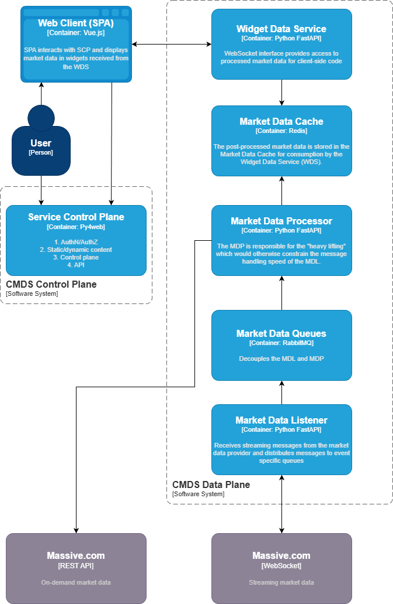

<!-- These are examples of badges you might want to add to your README:
   please update the URLs accordingly 

-->

# kuhl-haus-mdp

Market data processing library.

## TL;DR
Non-business Massive (AKA Polygon.IO) accounts are limited to a single WebSocket connection per asset class and it has to be fast enough to handle messages in a non-blocking fashion or it'll get disconnected.  The market data processing pipeline consists of loosely-coupled market data processing components so that a single WebSocket connection can handle messages fast enough to maintain a reliable connection with the market data provider.

Per, https://massive.com/docs/websocket/quickstart#connecting-to-the-websocket:
> *By default, one concurrent WebSocket connection per asset class is allowed. If you require multiple simultaneous connections for the same asset class, please [contact support](https://massive.com/contact).*

# Components Summary

Non-business Massive (AKA Polygon.IO) accounts are limited to a single WebSocket connection per asset class and it has to be fast enough to handle messages in a non-blocking fashion or it'll get disconnected.  The Market Data Listener (MDL) connects to the Market Data Source (Massive) and subscribes to unfiltered feeds. MDL inspects the message type for selecting the appropriate serialization method and destination Market Data Queue (MDQ).  The Market Data Processors (MDP) subscribe to raw market data in the MDQ and perform the heavy lifting that would otherwise constrain the message handling speed of the MDL.  This decoupling allows the MDP and MDL to scale independently.  Post-processed market data is stored in the MDC for consumption by the Widget Data Service (WDS).  Client-side widgets receive market data from the WDS, which provides a WebSocket interface to MDC pub/sub streams and cached data.

[]

# Component Descriptions

## Market Data Listener (MDL)
The MDL performs minimal processing on the messages.  MDL inspects the message type for selecting the appropriate serialization method and destination queue.  MDL implementations may vary as new MDS become available (for example, news).

MDL runs as a container and scales independently of other components. The MDL should not be accessible outside the data plane local network.

### Code Libraries
- **`MassiveDataListener`** (`components/massive_data_listener.py`) - WebSocket client wrapper for Massive.com with persistent connection management and market-aware reconnection logic
- **`MassiveDataQueues`** (`components/massive_data_queues.py`) - Multi-channel RabbitMQ publisher routing messages by event type with concurrent batch publishing (100 msg/frame)
- **`WebSocketMessageSerde`** (`helpers/web_socket_message_serde.py`) - Serialization/deserialization for Massive WebSocket messages to/from JSON
- **`QueueNameResolver`** (`helpers/queue_name_resolver.py`) - Event type to queue name routing logic

## Market Data Queues (MDQ)

**Purpose:** Buffer high-velocity market data stream for server-side processing with aggressive freshness controls
- **Queue Type:** FIFO with TTL (5-second max message age)
- **Cleanup Strategy:** Discarded when TTL expires
- **Message Format:** Timestamped JSON preserving original Massive.com structure
- **Durability:** Non-persistent messages (speed over reliability for real-time data)
- **Independence:** Queues operate completely independently - one queue per subscription
- **Technology**: RabbitMQ

The MDQ should not be accessible outside the data plane local network.

### Code Libraries
- **`MassiveDataQueues`** (`components/massive_data_queues.py`) - Queue setup, per-queue channel management, and message publishing with NOT_PERSISTENT delivery mode
- **`MassiveDataQueue`** enum (`enum/massive_data_queue.py`) - Queue name constants for routing (AGGREGATE, TRADES, QUOTES, HALTS, UNKNOWN)

## Market Data Processors (MDP)
The purpose of the MDP is to process raw real-time market data and delegate processing to data-specific handlers.  This separation of concerns allows MDPs to handle any type of data and simplifies horizontal scaling.  The MDP stores its processed results in the Market Data Cache (MDC).

The MDP:
- Hydrates the in-memory cache on MDC
- Processes market data
- Publishes messages to pub/sub channels
- Maintains cache entries in MDC

MDPs runs as containers and scale independently of other components. The MDPs should not be accessible outside the data plane local network.

### Code Libraries
- **`MassiveDataProcessor`** (`components/massive_data_processor.py`) - RabbitMQ consumer with semaphore-based concurrency control for high-throughput scenarios (1,000+ events/sec)
- **`MarketDataScanner`** (`components/market_data_scanner.py`) - Redis pub/sub consumer with pluggable analyzer pattern for sequential message processing
- **Analyzers** (`analyzers/`)
  - **`MassiveDataAnalyzer`** (`massive_data_analyzer.py`) - Stateless event router dispatching by event type
  - **`LeaderboardAnalyzer`** (`leaderboard_analyzer.py`) - Redis sorted set leaderboards (volume, gappers, gainers) with day/market boundary resets and distributed throttling
  - **`TopTradesAnalyzer`** (`top_trades_analyzer.py`) - Redis List-based trade history with sliding window (last 1,000 trades/symbol) and aggregated statistics
  - **`TopStocksAnalyzer`** (`top_stocks.py`) - In-memory leaderboard prototype (legacy, single-instance)
- **`MarketDataAnalyzerResult`** (`data/market_data_analyzer_result.py`) - Result envelope for analyzer output with cache/publish metadata
- **`ProcessManager`** (`helpers/process_manager.py`) - Multiprocess orchestration for async workers with OpenTelemetry context propagation

## Market Data Cache (MDC)

**Purpose:** In-memory data store for serialized processed market data.
* **Cache Type**: In-memory persistent or with TTL
- **Queue Type:** pub/sub
- **Technology**: Redis

The MDC should not be accessible outside the data plane local network.

### Code Libraries
- **`MarketDataCache`** (`components/market_data_cache.py`) - Redis cache-aside layer for Massive.com API with TTL policies, negative caching, and specialized metric methods (snapshot, avg volume, free float)
- **`MarketDataCacheKeys`** enum (`enum/market_data_cache_keys.py`) - Internal Redis cache key patterns and templates
- **`MarketDataCacheTTL`** enum (`enum/market_data_cache_ttl.py`) - TTL values balancing freshness vs. API quotas vs. memory pressure (5s for trades, 24h for reference data)
- **`MarketDataPubSubKeys`** enum (`enum/market_data_pubsub_keys.py`) - Redis pub/sub channel names for external consumption

## Widget Data Service (WDS)
**Purpose**:
1. WebSocket interface provides access to processed market data for client-side code
2. Is the network-layer boundary between clients and the data that is available on the data plane

WDS runs as a container and scales independently of other components.  WDS is the only data plane component that should be exposed to client networks.

### Code Libraries
- **`WidgetDataService`** (`components/widget_data_service.py`) - WebSocket-to-Redis bridge with fan-out pattern, lazy task initialization, wildcard subscription support, and lock-protected subscription management
- **`MarketDataCache`** (`components/market_data_cache.py`) - Snapshot retrieval for initial state before streaming

## Service Control Plane (SCP)
**Purpose**:
1. Authentication and authorization
2. Serve static and dynamic content via py4web
3. Serve SPA to authenticated clients
4. Injects authentication token and WDS url into SPA environment for authenticated access to WDS
5. Control plane for managing application components at runtime
6. API for programmatic access to service controls and instrumentation.

The SCP requires access to the data plane network for API access to data plane components.

### Code Libraries
- **`Observability`** (`helpers/observability.py`) - OpenTelemetry tracer/meter factory for distributed tracing and metrics
- **`StructuredLogging`** (`helpers/structured_logging.py`) - JSON logging for K8s/OpenObserve with dev mode support
- **`Utils`** (`helpers/utils.py`) - API key resolution (MASSIVE_API_KEY → POLYGON_API_KEY → file) and TickerSnapshot serialization

