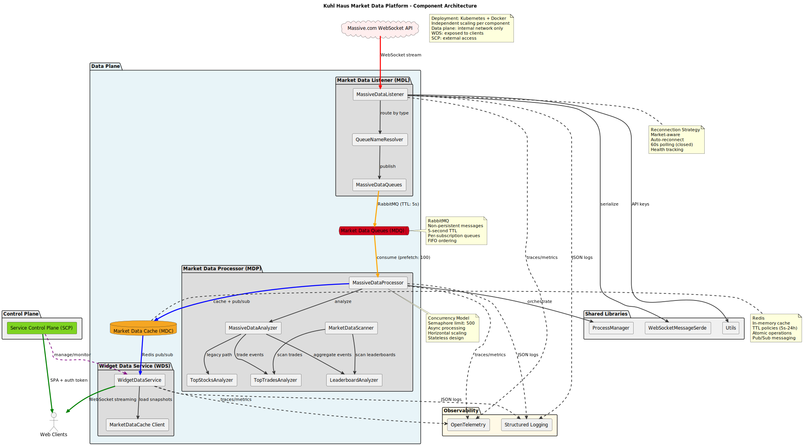

============
Architecture
============

Component Architecture
======================

The Kuhl Haus Market Data Platform follows a distributed microservices architecture with clear separation of concerns between data ingestion, processing, caching, and distribution layers.

   Market Data Platform Component Architecture

Architecture Overview
=====================

Data Plane Components
----------------------

**Market Data Listener (MDL)**
  WebSocket client connecting to Massive.com, routing events to appropriate queues with minimal processing overhead.

**Market Data Queues (MDQ)**
  RabbitMQ-based FIFO queues with 5-second TTL, buffering high-velocity streams for distributed processing.

**Market Data Processor (MDP)**
  Horizontally-scalable event processors with semaphore-based concurrency (500 concurrent tasks), delegating to pluggable analyzers.

**Market Data Cache (MDC)**
  Redis-backed cache layer with TTL policies (5s-24h), atomic operations, and pub/sub distribution.

**Widget Data Service (WDS)**
  WebSocket-to-Redis bridge providing real-time streaming to client applications with fan-out pattern.

Control Plane
-------------

**Service Control Plane (SCP)**
  OAuth authentication, SPA serving, runtime controls, and management API (external repository: kuhl-haus-mdp-app).

Observability
-------------

All components emit OpenTelemetry traces/metrics and structured JSON logs for Kubernetes/OpenObserve integration.

Deployment Model
================

The platform deploys to Kubernetes with independent scaling per component:

- **Data plane**: Internal network only (MDL, MDQ, MDP, MDC)
- **Client interface**: Exposed to client networks (WDS)
- **Control plane**: External access (SCP)

All components run as Docker containers with automated deployment via Ansible playbooks and Kubernetes manifests (kuhl-haus-mdp-deployment repository).
